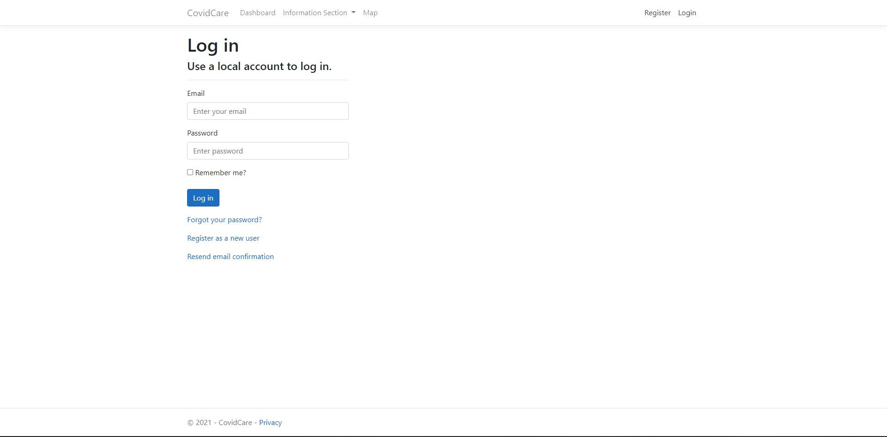
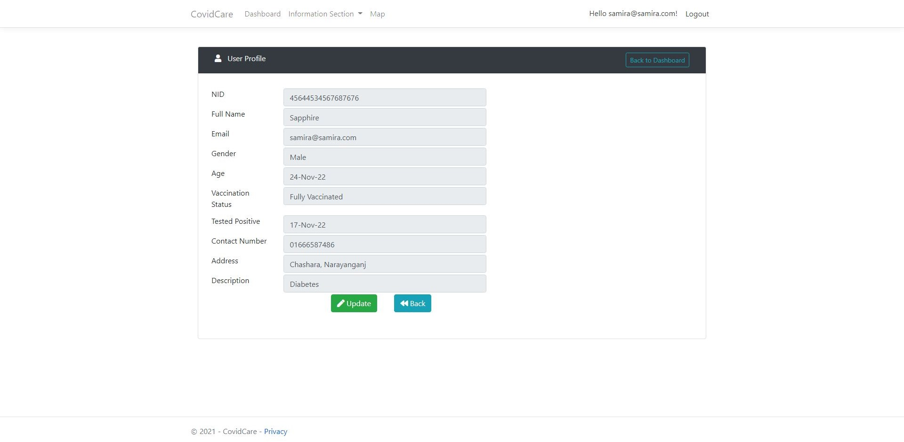
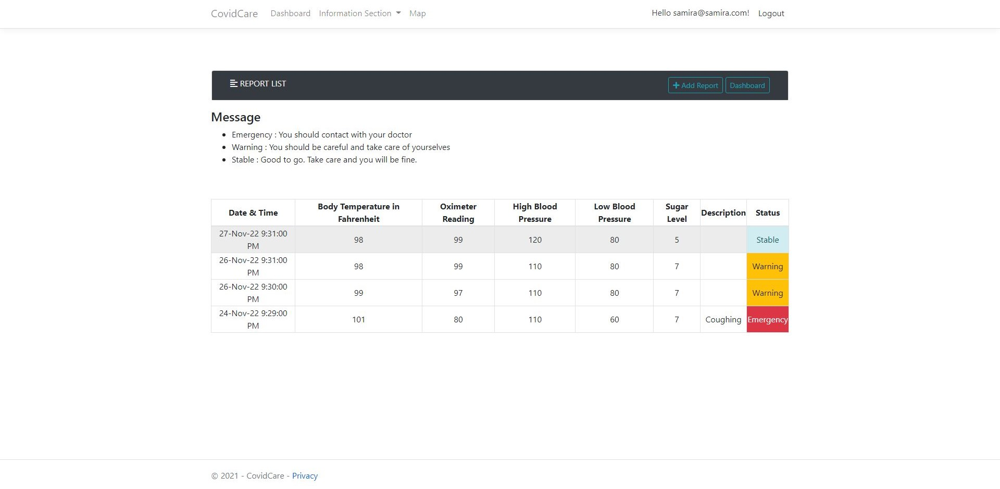
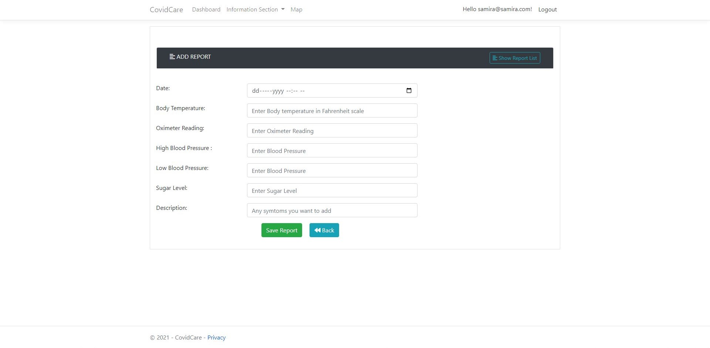

# CovidCare
A website built using C# and Asp.Net for COVID affected people. It records all the daily updates (such as blood pressure, sugar level, body temperature, etc) of a covid patient and provides suggestion based on
the condition of the patient. Moreover, Users get the information of nearest hospitals, pharmacies which is implemented using OpenStreetMap.
Additionally, information such as no. of beds available and emergency services such as oxygen cylinder provider, ambulance, etc is given for patients.
Lastly, they also get the updated information published by the government.

## Login

## Profile

## Report List

>List of crime report and criminals can be sorted using any column.
## Add Report

### Criminals List

## Admin Dashboard

